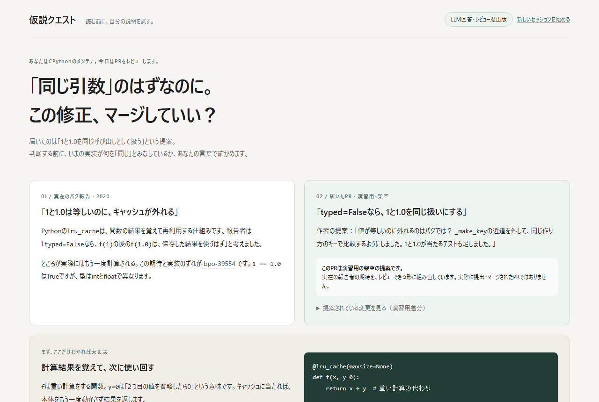
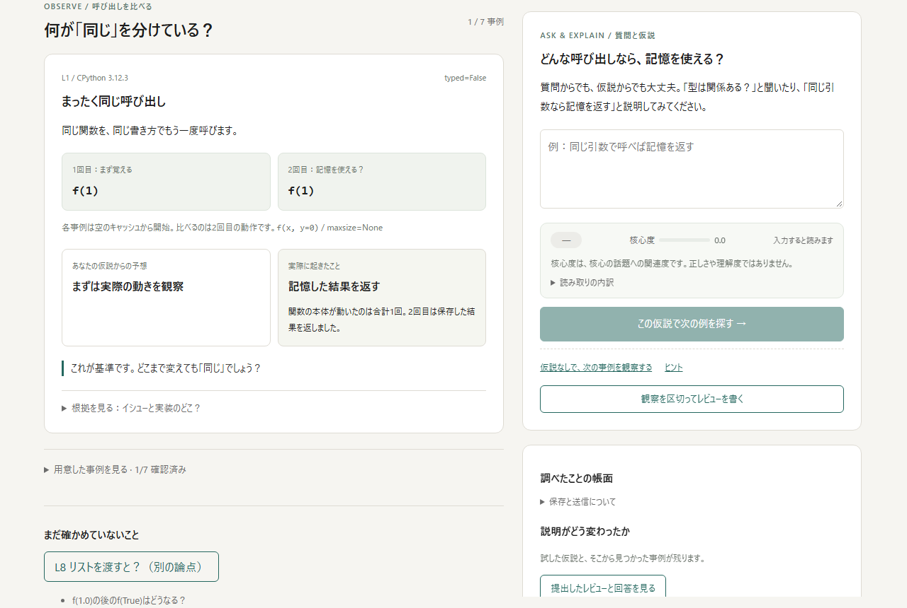

# 仮説クエスト (Hypothesis Quest)

> 読む前に、自分の説明を試す。

AI が書いたコードを **読んで理解する** 代わりに、**自分の言葉で「この仕組みが守っているルール」を書く** ブラウザゲームです。書いた一文はその場で判定され、**その説明では説明できない事例** が向こうからやってきます。

**▶ 遊ぶ: https://ebiharadev.org**

> **公開は2026年9月30日まで**（日本時間）。10月1日0時に画面と API が自動で停止します。それ以降に来た方は、以下のスクリーンショットと[ローカルでの動かし方](#ローカルで動かす)をどうぞ。



TypeSafe Jev ハッカソンの制作物です。Jev は「あなたの理解度を採点する」ためではなく、**あなたが書いた自然文を読み取る** ために使っています。

---

## 何をする遊びか

あなたは CPython のメンテナです。今日、こんな PR が届きました。

> **「`typed=False` なら、`f(1)` と `f(1.0)` を同じ呼び出しとして扱う」**
> 作者いわく「`1 == 1.0` なのにキャッシュが外れるのはバグ。近道を外せば直る。テストも足した」

マージしていいか決めるには、**いまの実装が何を「同じ呼び出し」とみなしているか** を、自分の言葉で言えなければいけません。そこで一文を書きます。すると、その一文では説明のつかない事例が出てきます。

これは架空の PR ですが、中身は実在のバグ報告 [bpo-39554](https://bugs.python.org/issue39554)（2020年）の報告者の期待そのものです。作者本人（Raymond Hettinger）が実際に下した判断を、あなたが追体験することになります。



## 一巡の流れ

```
  あなたが一文を書く
        「同じ引数で呼べば記憶を返す」
              │
              ▼
  Jev が、その文が挙げている条件を読み取る
              │
              ▼
  コードが条件を7つの事例に当てはめて、結果を予想する
              │
              ▼
  コードが、事前に実測済みの結果と照合する
              │
              ▼
  食い違った事例が出てくる
        f(1) のあと f(1, 0) → 予想「記憶を返す」/ 実際「もう一度計算する」
              │
              ▼
  あなたが説明を書き直す
```

質問からでも始められます。「型は関係ある？」と聞けば、検証済みの比較から「はい／いいえ／場合による／まだ答えられません」が返り、根拠の事例が並びます。用語を覚えてから例題を解くのではなく、**自分がぶつかった問題に、あとから用語と構造が結びつく** 順番です。

止まっていると、経過時間・入力量・スクロール・ポインタの動きから「いまどんな助けが要るか」を Jev が読み、書き出しの候補や次の一手を出します。入力した文そのものは、この判定には送っていません。

> **ネタバレ注意**: `docs/subjects/lru-cache.md` と `docs/journey.md` には答えが書いてあります。先に遊びたい方は開かないでください。

## 設計の核心 — Jev に正解を判定させない

| 担当 | 仕事 |
| --- | --- |
| **Jev** | 自然文が「どの条件を挙げているか」を6軸の確率で読む。入力が質問か仮説かも読む |
| **コード** | 読み取った条件を事例に当てはめ、実測済みの結果と照合し、次に出す事例を選ぶ |
| **LLM** | 言葉を書くだけ。判定には触れない。生成文は Jev が「根拠にない主張が混じっていないか」で検問する |
| **あなた** | 仮説を書く。Jev の読み取りが違っていたら、送信前に画面で気づいて直す |

**正解を判定するのは常にコードで、材料は事前に実測した固定データです。** この分担のおかげで、

- AI が反例を捏造できません（事例は CPython 3.12.3 での実測値）
- 「AI に理解度を採点される」不快感が構造的に発生しません
- Jev の確信度が低いときは、「理解不足」ではなく **解釈の確認** に回せます

LLM は解説とヒントの文章を書くだけで、結果やクリア判定を動かせません。検問は Jev の Noul 判定で行いますが、誤りゼロの保証ではありません。

## 使っている技術

Next.js + React + TypeScript、Cloudflare Workers + D1（OpenNext 経由）。判定は [TypeSafe Jev](https://typesafe.ai) の System One API（Noul / Choice）、文章生成は Ollama Cloud の `gemma4:31b`。

```
src/subject/lru.ts        題材データ。7事例＋別論点＋未提示事例、6軸の問いと基準
src/lib/lru-input.ts      入力を Jev で読む（軸の確率＋質問か仮説か＋話題）
src/lib/lru-select.ts     予想と照合、次に出す事例の選択（すべてコード側）
src/lib/support.ts        止まり方から「どの助けが要るか」を読む
src/lib/narration.ts      LLM 生成と、その検問
src/app/page.tsx          画面
src/app/api/              read / predict / support / explain / review / notebook / session
```

`/orders` に開発用のダミー題材（架空の注文登録 API）も残っています。

## ローカルで動かす

Node.js 22.18 以降が必要です。Jev と Ollama Cloud の API キーは各自で用意してください。

```bash
npm ci
cp .dev.vars.example .dev.vars   # JEV_API_KEY と OLLAMA_API_KEY を記入する
npm run dev                      # http://localhost:3002
```

`.dev.vars` は Git に入りません。Cloudflare へ配信する場合は `wrangler.example.jsonc` を `wrangler.jsonc` に複製し、自分の `account_id` / `database_id` / ルートを設定してください（本番用の実ファイルはこのリポジトリに含めていません）。

```bash
npm run preview   # Workers としてローカル起動 http://localhost:8787
npm run deploy    # ビルド → D1 migration → 配信
```

## テストと評価

```bash
npm test                        # 単体40件。判定・検問・保存・公開期限
npx playwright install chromium
npm run test:e2e                # 画面回帰（API 応答は固定）
npm run test:e2e:live           # 実 Jev / 実 LLM を使う経路
npm run verify:lru              # 実際の CPython 3.12.3 と画面データを照合（9件）
```

`verify:lru` は Python 3.12.3 を呼びます（Windows では WSL 経由）。**画面に出る結果は、すべてこのスクリプトで再現できる実測値です。**

実 Jev を使う評価は `eval:jev` / `eval:lru` / `eval:questions` / `eval:narration`。結果は `docs/eval/` に日付付きで残しています（成功も失敗も消していません）。

## ハーネス — 体験と題材を批判的に測る

「面白いはず」を検証可能にするための道具立てです。原則は **測ることはスクリプト、読んで決めることはスキル**。

| 何を測るか | コマンド |
| --- | --- |
| 固定戦略ボットで攻略できてしまわないか | `npm run harness:stress` |
| プレイ記録から核心への接近と離脱点 | `npm run harness:notebook` |
| 題材が謎として成立しているか | `npm run subject:check` |
| 助け舟の判定が止まり方を区別できるか | `npm run harness:support` |
| 自然言語のコード規約（後述） | `npm run lint:jev:check` |

`lint:jev` は Jev を使った自然言語リントです。「Jev に投げる問いが1問1判断になっているか」「LLM の出力が判定に流れ込んでいないか」「相棒の台詞が答えを漏らしていないか」といった、型検査では見えない規約を `rules/` に自然文で書いて検査します。

題材そのものを探す道具もあります。`subject:mine` で GitHub の古いイシューを掘り、`subject:rank` が Jev で「謎として成立しそうか」を順位付けします。

## ドキュメント

| ファイル | 内容 |
| --- | --- |
| [docs/concept.md](docs/concept.md) | 企画の詳細。事例カード・Jev 呼び出し設計・不可侵のルール |
| [docs/decisions.md](docs/decisions.md) | なぜこの1本に絞ったか。検討した8案と不採用理由、「それ LLM でよくね？」への回答 |
| [docs/journey.md](docs/journey.md) | プレイ体験の設計（**答えを含みます**） |
| [docs/subjects/lru-cache.md](docs/subjects/lru-cache.md) | 題材の詳細（**答えを含みます**） |
| [docs/harness.md](docs/harness.md) | ハーネスの全体像と使い方 |
| [docs/deployment.md](docs/deployment.md) | Workers + D1 の構成・公開期限・レート制限 |
| [docs/backlog.md](docs/backlog.md) / [docs/roadmap.md](docs/roadmap.md) | 残タスクとフェーズ |
| [docs/HANDOFF.md](docs/HANDOFF.md) | 最新の実装状態と検証記録。**何が検証済みで何が未検証か** はここが正 |
| [docs/eval/](docs/eval/) | 測定結果の生ログ。ボット・リント・試遊・題材検査 |

## 保存と送信について

- 入力・読み取り・返答・提示した事例・提出内容を **D1 に保存** します（開発中はローカル、公開版は Cloudflare）。
- 入力文は TypeSafe Jev へ、質問文と提出文および限定した根拠は Ollama Cloud へ送信します。
- 記録はブラウザのセッション Cookie で分離されます。認証はなく、匿名です。自動削除は未実装です。
- **秘密情報は入力しないでください。**
- 公開版は IP 単位のレート制限付きです。詳細は [deployment.md](docs/deployment.md)。

## ライセンス

ライセンス未設定のため、既定では著作権者に全権利が留保されます。参照・学習にはご自由にどうぞ。再利用をご希望の方はご連絡ください。
